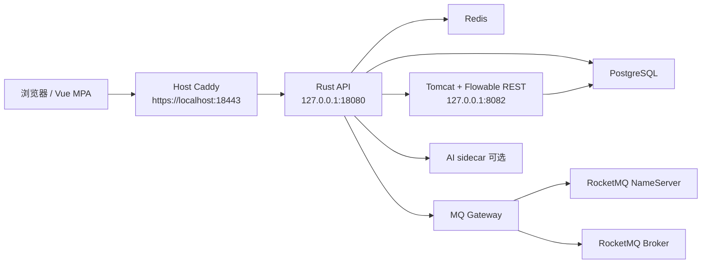

# 部署指南

当前仓库的部署主文档。文档基线：**2026-08-11**。

## 0. Vault 基线

当前仓库使用 **Vault CE + AppRole + Vault Agent 模板文件** 交付运行时密钥。

固定约束：

- `.env`、compose env、systemd env 和 host 启动文件只保留非敏感 bootstrap 配置。
- 长期敏感信息只允许存放在 Vault `kv/fms/*`。
- Docker、host、systemd、acceptance 入口启动前都应运行 Vault bootstrap 或 Vault Agent 渲染。
- Python / Rust 主程序缺失渲染文件或关键 secret 时应拒绝启动。

固定 Vault 路径：

- `kv/fms/shared`
- `kv/fms/api`
- `kv/fms/worker`
- `kv/fms/rust-api`
- `kv/fms/flowable`

固定 AppRole：

- `fms-api`
- `fms-worker`
- `fms-rust-api`
- `fms-ops-bootstrap`

自建 Vault CE 最小 bootstrap：

1. 启动 Vault 容器或本机 Vault。
2. 复制 `deploy/vault/bootstrap.secrets.env.example` 为 `deploy/vault/bootstrap.secrets.env`。
3. 替换所有占位符。
4. 运行 `scripts/vault/Initialize-VaultCe.ps1` 或对应 bootstrap 脚本。

敏感运行产物默认落在 gitignored 路径，不应提交：

- `deploy/vault/.runtime/root-token.txt`
- `deploy/vault/.runtime/unseal-keys.json`
- `deploy/vault/approle/*.role_id`
- `deploy/vault/approle/*.secret_id`
- `deploy/vault/bootstrap.secrets.env`
- `deploy/docker/.vault/**`

## 1. 当前推荐方案

### 1.1 标准 Docker runtime

推荐入口：

```powershell
.\scripts\fms.ps1 -Command start -Runtime docker
```

编排文件：

- `deploy/docker/docker-compose.distributed.yml`

适合：

- 本机开发
- 联调
- 单机压测
- 上云前预演
- 默认验收基线

### 1.2 Host Rust runtime

入口：

```powershell
.\scripts\fms.ps1 -Command start -Runtime host
```

Host 模式会启动本机辅助服务并运行 Rust API，适合本机联调和排障。它依赖本机 PostgreSQL、Java、Rust toolchain，以及仓库内的 Vault、Redis、Tomcat 运行资产。

### 1.3 Edge runtime

入口：

```powershell
.\deploy\docker\Start-FlightMonitorDocker-Edge.bat
```

编排文件：

- `deploy/docker/docker-compose.edge.yml`

适合资源受限环境和边缘可用性验证。

## 2. 当前实际拓扑

### 2.1 标准 Docker 拓扑

默认服务（以 `docker-compose.distributed.yml` 为准）：

- `postgres`（及可选 standby）
- `redis`
- `rocketmq-namesrv` / `rocketmq-broker`（及可选第二组）
- `mq-gateway`
- `rust-api`
- `flowable`（及 `flowable-db-bootstrap`）
- `vault`（及可选第二节点）
- 宿主机 `caddy`（由 `fms.ps1` 拉起，不在 compose 服务列表里）



说明：

- `rust-api` 是默认 HTTP / SSE / 静态前端入口。
- Python worker **不是**该 compose 的默认服务；后台任务可按 host/systemd 另部。
- AI 侧车同样可选，不替代 Rust HTTP。
- RocketMQ 相关服务用于事件消息边界。
- Flowable 独立运行，不混入应用镜像。

### 2.2 Host Rust 拓扑

Host 模式会自动检测并按需启动宿主机基础设施：

- PostgreSQL（检测是否运行，不自动启停）
- Redis
- Vault（dev 模式或已有实例）
- Tomcat / Flowable
- Caddy HTTP/3 代理
- Rust API 进程

Host 模式特性：

- 默认执行数据库迁移（基线 + `sqlx migrate run`），可通过 `-SkipMigrations` 跳过
- 默认 `cargo build --release` 后后台启动二进制，可通过 `-UseCargoRun` 前台运行
- 各组件独立日志文件位于 `.runtime/host-services/{service}/`
- 支持 `status` 命令查看所有组件运行状态和端口
- PostgreSQL 不自动停止（避免数据丢失）

### 2.3 Edge 拓扑

边缘部署服务：

- `nginx`
- `rust-api`
- `postgres`
- `redis`

边缘模式不包含 Flowable、RocketMQ 与 Python worker；相关能力应具备降级行为。

## 3. 访问地址

### 3.1 标准 Docker

- 系统入口：`https://localhost:18443`
- 健康检查：`https://localhost:18443/api/v2/health/ping`
- 登录页：`https://localhost:18443/frontend/login.html`
- Rust 直连：`http://localhost:18080`
- Flowable API：`http://localhost:8082/flowable-rest/service/management/engine`

### 3.2 Edge

- 系统入口：`http://localhost:18080`
- 健康检查：`http://localhost:18080/api/v2/health/ping`
- 登录页：`http://localhost:18080/frontend/login.html`

### 3.3 前端路径

- 正式 Vue 页：`/frontend/<page>.html`（来自 `frontend/vue-app/dist`）
- 兼容旧页：`/frontend/html/<page>.html`
- 注意：根路径 `/` 当前仍 302 到 `/frontend/html/login.html`；日常验收请直接打开 `/frontend/login.html`

## 4. 启动、停止与日志

标准 Docker：

```powershell
.\scripts\fms.ps1 -Command start -Runtime docker
.\scripts\fms.ps1 -Command status -Runtime docker
.\scripts\fms.ps1 -Command logs -Runtime docker
.\scripts\fms.ps1 -Command stop -Runtime docker
.\scripts\fms.ps1 -Command restart -Runtime docker
```

Host Rust：

```powershell
.\scripts\fms.ps1 -Command start -Runtime host
.\scripts\fms.ps1 -Command start -Runtime host -SkipBuild
.\scripts\fms.ps1 -Command start -Runtime host -SkipMigrations
.\scripts\fms.ps1 -Command status -Runtime host
.\scripts\fms.ps1 -Command logs -Runtime host
.\scripts\fms.ps1 -Command stop -Runtime host
```

Host 模式日志目录：`.runtime/host-services/{service}/`，每个服务独立的 `stdout.log` 和 `stderr.log`。

Edge：

```powershell
.\scripts\fms.ps1 -Command start -Runtime edge
.\scripts\fms.ps1 -Command status -Runtime edge
.\scripts\fms.ps1 -Command logs -Runtime edge
.\scripts\fms.ps1 -Command stop -Runtime edge
```

底层 compose 状态：

```powershell
docker compose -f deploy\docker\docker-compose.distributed.yml ps
```

## 5. 环境文件

### 5.1 标准 Docker

Bootstrap 文件：

- `deploy/docker/.env.local`

Vault runtime 文件：

- `deploy/docker/.vault/distributed/rendered.env`
- `deploy/docker/.vault/distributed/runtime.env`

常见 bootstrap 项：

- `DB_NAME`
- `DB_USER`
- `DB_HOST`
- `DB_PORT`
- `CORS_ALLOWED_ORIGINS`
- `RUST_API_HOST_PORT`
- `FLOWABLE_HOST_PORT`
- `ROCKETMQ_NAMESRV_HOST_PORT`
- `ROCKETMQ_BROKER_HOST_PORT`
- `MQ_GATEWAY_HOST_PORT`
- `VAULT_ADDR`
- `VAULT_ROLE_ID_FILE`
- `VAULT_SECRET_ID_FILE`
- `VAULT_AGENT_CONFIG`
- `VAULT_RENDERED_ENV_FILE`

### 5.2 Edge

Bootstrap 文件：

- `deploy/docker/.env.edge`

Vault runtime 文件：

- `deploy/docker/.vault/edge/rendered.env`
- `deploy/docker/.vault/edge/runtime.env`

### 5.3 安全约束

- `VAULT_*` bootstrap 项必须完整。
- 渲染文件必须包含 `DB_PASSWORD`、`DB_REPLICATION_PASSWORD`、`REDIS_PASSWORD`、`JWT_SECRET_KEY`、`AI_CONFIG_ENCRYPTION_KEY`、`FLOWABLE_ADMIN_PASSWORD` 等关键 secret。
- `CORS_ALLOWED_ORIGINS` 必须是精确 Origin 白名单。
- 内部依赖端口默认绑定 loopback，不应直接暴露到外网。
- 外部访问应通过 Caddy、边缘 Nginx 或云负载均衡暴露。

### 5.4 安全基线
- 依赖版本：定期运行 `cargo audit`（Rust）和 `safety`/`bandit`（Python）
- 漏洞修复记录：写在 PR / 发布说明中
- 审计配置：`services/api-server/audit.toml`（Rust 依赖漏洞审计白名单）
- 容器安全：Rust API 容器以非 root 用户运行

## 6. 数据与迁移

当前最新迁移：

- `121_add_soft_delete_columns.sql`

引用完整性与删除策略（迁移 `120`/`121`）：

- `120_drop_all_foreign_keys.sql` 移除全部外键约束，引用完整性改由应用层逻辑保证，巡检兜底脚本：`scripts/database/check_referential_integrity.sql`（孤儿行 + 软删引用两类检查，建议纳入 nightly）。
- `121_add_soft_delete_columns.sql` 为审计表新增 `deleted_at` 列（`users` 复用 `is_active`）；产品删除统一软删除，审计禁止物理删除业务数据。新增迁移不得重新引入 `FOREIGN KEY`/`REFERENCES`（回归测试 `tests/tools/test_no_new_foreign_keys.py`、`test_no_physical_delete.py` 守护）。

全新 Docker 启动会按镜像和初始化脚本准备当前基线。复用已有数据库卷时，按 `migrations/*.sql` 编号顺序补齐未应用迁移。Host 模式默认自动执行迁移（基线脚本 + `sqlx migrate run`）。

注意：`CREATE INDEX CONCURRENTLY` 必须独占一个迁移文件，且首行 `-- no-transaction`。空库可直接 `sqlx migrate run --source migrations` 应用到最新编号。

## 7. Python 角色

- HTTP 主链在 Rust；Python 只做 AI 侧车（及可选后台 worker）。
- 当前侧车代码：`services/ai-sidecar/`。
- 历史完整 Python 后端：`legacy-backend/`（gitignore，本地归档）。
- 不要新增 Python HTTP 作为默认入口。

## 8. 云上演进方向

从本机 Docker 向云上迁移时，建议保持当前角色边界：

1. 保持 Rust API / Flowable / MQ gateway（及可选 AI 侧车、后台 worker）的职责拆分。
2. 先迁移 PostgreSQL 到独立或托管库。
3. 再迁移 Redis。
4. 再拆分 API、Flowable、MQ、侧车到独立主机或服务。
5. 最后用云负载均衡或边缘代理替换本机 Caddy。

## 9. 验收基线

### 9.1 标准 Docker

至少确认：

- `https://localhost:18443/api/v2/health/ping` 返回 200。
- `https://localhost:18443/frontend/login.html` 可访问。
- Flowable 引擎接口可访问。
- `rust-api` 健康。
- `mq-gateway` 健康。
- `flowable` 稳定运行。

### 9.2 Edge

至少确认：

- `http://localhost:18080/api/v2/health/ping` 返回 200。
- `http://localhost:18080/frontend/login.html` 可访问。
- `rust-api` 容器内存符合限制。
- 核心功能可用。
- worker、Flowable、MQ 不存在时相关能力能清晰降级。

## 10. 高可用与故障切换

分布式拓扑 `deploy/docker/docker-compose.distributed.yml` 增加了三组 HA 组件：
PostgreSQL 流复制备库（P1e）、RocketMQ 双 namesrv + 双 broker（P1g）、Vault raft 双节点（P1h）。

### 10.1 PostgreSQL Failover

拓扑：主库服务 `postgres`（同步复制，`synchronous_commit=remote_apply` +
`synchronous_standby_names=fm-pg-standby-01`）与备库服务 `postgres-standby`。

- **备库如何建立**：`postgres-standby` 首次启动（空卷）时，等待主库就绪后执行
  `pg_basebackup -R` 从主库拉取基础备份，写入
  `primary_conninfo`（`application_name=fm-pg-standby-01`）并创建 `standby.signal`，
  以 hot-standby 模式启动，可读不可写。参考模板：
  `deploy/postgresql/postgresql-standby.conf.example`、
  `deploy/postgresql/bootstrap-standby.sh.example`。
- **复制账号 `fm_replicator` 如何配置**：由 `scripts/database/setup_postgresql.sql`
  在主库初始化时创建（`REPLICATION` 角色），口令来自 `flight_monitor.replication_password`
  GUC（compose 通过 `DB_REPLICATION_PASSWORD` 注入，强制强口令）。主库 `pg_hba` 允许
  `replication fm_replicator`（见 `deploy/postgresql/pg_hba.primary.conf.example`）。
- **AI 只读查询账号 `ai_query_ro` 如何配置**：`setup_postgresql.sql` 仅创建角色、
  授予 `ai_query` schema 的 `SELECT`，并设置 `default_transaction_read_only`、
  `statement_timeout` / `idle_in_transaction_session_timeout`。**不**在仓库 SQL
  中写入口令。口令必须由 Vault / 运维在目标库上独立设置与轮换
  （`ALTER ROLE ai_query_ro WITH PASSWORD ...`），再写入渲染运行时的
  `AI_QUERY_DB_PASSWORD`。已部署且曾使用历史仓库默认口令的环境必须立即轮换。
- **提升备库为主库（failover）**：
  1. 确认主库确已不可用，避免脑裂。
  2. 在备库执行 `SELECT pg_promote();`（或容器内 `pg_ctl promote -D "$PGDATA"`）。
     备库移除 `standby.signal` 并变为可写主库。
  3. 将应用 `DB_HOST` / `DB_REPLICATION_HOST` 重指向新主库（原 `postgres-standby`）。
  4. 旧主库恢复后需重新作为备库 bootstrap（清空数据卷或 `pg_rewind` 后重挂）。
- **注意**：同步复制下，若备库断开，主库写入会阻塞。若需要非阻塞，改用
  `synchronous_commit=on` 并移除 `synchronous_standby_names`（compose 命令中已注释说明）。

### 10.2 RocketMQ broker 集群

- 两个 name server：`rocketmq-namesrv`（9876）与 `rocketmq-namesrv-2`（容器内 9877）。
- 两个 broker：`rocketmq-broker`（意图 MASTER）与 `rocketmq-broker-2`（意图 SLAVE），
  共享集群名 `fms_cluster`。
- broker 与 `mq-gateway` 均通过 `NAMESRV_ADDR="rocketmq-namesrv:9876;rocketmq-namesrv-2:9877"`
  连接两个 name server；任一 name server 或 broker 故障时仍可路由/收发。
- **假设**：当前 Rust 版 RocketMQ（`libs/vendor/rocketmq-rust`）broker 仅从
  `NAMESRV_ADDR` / `-n` 读取 name server 列表；`brokerName` / `brokerId` / `brokerRole`
  / 集群名需通过 `broker.toml`（`-c configFile`）设置。compose 中的
  `BROKER_CLUSTER_NAME` / `BROKER_NAME` / `BROKER_ID` / `BROKER_ROLE` / `HA_ENABLE`
  为意图声明；如需真正主从复制，请挂载对应 `broker.toml`。

### 10.3 Vault HA（raft）

- `vault`（`node_id=vault-node-1`）与 `vault-02`（`VAULT_RAFT_NODE_ID=vault-node-2`）
  组成 raft 集群，共享 `deploy/vault/config/vault.hcl`。
- `vault.hcl` 的 `storage "raft"` 增加两个 `retry_join`（`https://vault:8200`、
  `https://vault-02:8200`），非 leader 节点自动加入。
- 每个节点通过 `VAULT_API_ADDR` / `VAULT_CLUSTER_ADDR` 广播自身服务名。
- **假设**：`node_id` 用环境变量 `VAULT_RAFT_NODE_ID` 覆盖（`vault server` 无
  `-node-id` 参数）；`retry_join` 的 `leader_ca_cert_file` 指向挂载的自签证书，
  按实际 CA 调整，或改用 `leader_tls_servername`。首次仍需 `vault operator init` +
  各节点 `unseal`。

## 11. 相关文档

- `README.md`
- `QUICK_START.md`
- `docs/SYSTEM_MANUAL.md`
- `docs/API_ROUTE_SNAPSHOT.md`
- `docs/SOURCE_OF_TRUTH.md`
- `docs/DOCUMENTATION_WORKFLOW.md`
