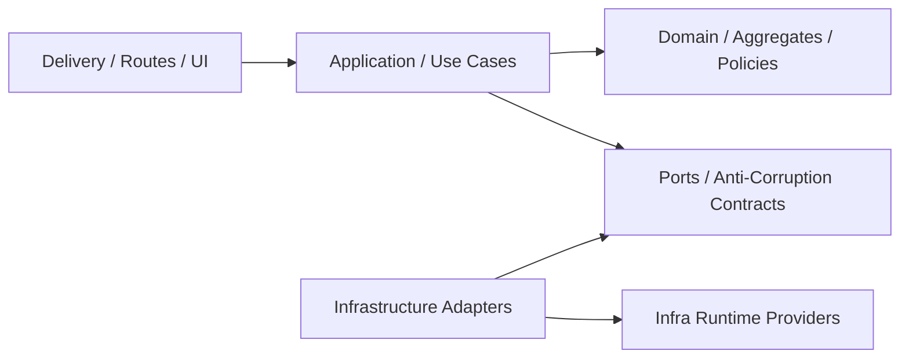

# Dependency Direction

## 当前约束

- `domain` 不依赖 `application`、`di`
- `infrastructure` 不依赖 `application`
- `api` 生产依赖不直接包含 `fms-infrastructure`、`sqlx`、`redis`
- `api` 路由生产代码不直接访问基础设施 repository 或原始 SQL
- 具体 repository 装配在 `fms-server`（`crates/server`）

## 当前例外策略

- 不再保留无期限例外；新增例外必须在测试中有显式 allowlist 和计划链接。
- Rust API 路由边界由 `services/api-server/crates/api/tests/layer_boundary_guard.rs` 拦截。
- Application 层基础设施债务由 `services/api-server/crates/application/tests/application_boundary_inventory.rs` 固定清单；清单只能减少，新增项必须附带修复计划。
