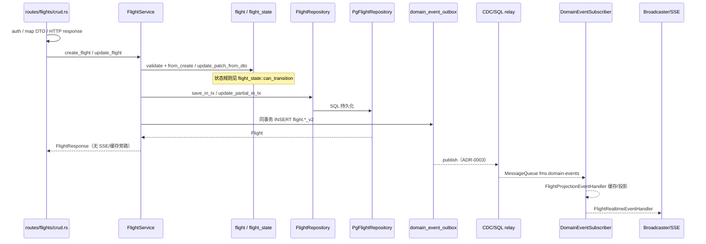

# Flight Write Sequence

对齐 [ADR-0002](ADR-0002-flight-core-write-boundary.md)。路径以 Rust `services/api-server` 为准。

## 说明

- **HTTP 写入口**：`services/api-server/crates/api/src/routes/flights/crud.rs`（`create_flight` / `update_flight`；`patch_flight` 委托 update）— **仅** auth / DTO / 调服务 / 审计 / HTTP 响应
- **应用写服务**：`application/src/services/flight_service.rs`（`create_flight` / `update_flight` / `update_flight_in_tx`）
- **领域模型与状态规则**：`domain/src/models/flight.rs`、`domain/src/models/flight_state.rs`
- **仓储端口**：`domain/src/ports/flight_repository.rs`（`FlightRepository` / `FlightUpdatePatch`）
- **仓储实现**：`infrastructure/src/repositories/pg_flight_repository.rs`；可选缓存装饰 `cached_flight_repository.rs`（仅失效，不定义状态）
- **Outbox**：同事务写 `flight.*_v2`；投递见 [ADR-0003](ADR-0003-domain-event-outbox-cdc-relay.md)
- **消费方**：`domain_event_subscriber_service` — 投影/缓存失效 + SSE（`Broadcaster`）

## 目标 vs 现状

| 目标（ADR-0002） | 现状（代码） |
|------------------|--------------|
| 命令 → `FlightService` → domain 规则 → `FlightRepository` 原子保存 | **已落地**：create/update 经 `FlightService` + port；status 校验 `can_transition` |
| 航班领域事件与核心表 **同事务** 写 `domain_event_outbox` | **已落地**：HTTP create/update 与 `update_flight_in_tx` 均写 `flight.*_v2`；AI 另写 action 级 `Flight.*` 事件 |
| 写后 SSE/缓存仅为消费方 | **已落地**：`crud` 与 `timeline` 路由均无旁路广播/失效；subscriber 驱动 SSE 与缓存失效 |
| 显式命令边界 | **已落地**：`FlightCreateCommand` / `FlightUpdateCommand` + `execute_create` / `execute_update` |

时间线事件类型：`flight.timeline_upserted_v2` / `flight.timeline_deleted_v2`（与核心航班 outbox 同一消费链）。

## 相关文档

- [ADR-0002 航班核心写链路边界](ADR-0002-flight-core-write-boundary.md)
- [FLIGHT_COMMAND_ENTRY_SPEC](FLIGHT_COMMAND_ENTRY_SPEC.md)
- [ADR-0003 Outbox CDC Relay](ADR-0003-domain-event-outbox-cdc-relay.md)
